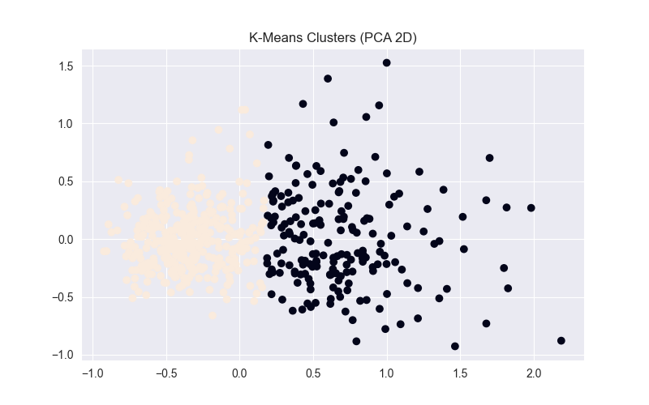
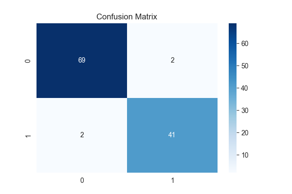

Breast Cancer Diagnosis with KNN and K-Means
===========================================

This project builds a simple workflow to explore and model the Wisconsin Breast Cancer dataset using two classic algorithms:

- K-Nearest Neighbors (KNN) for supervised diagnosis prediction.
- K-Means for unsupervised clustering with a PCA-based visualization.

All code lives in the notebook `breast_cancer_knn_kmeans.ipynb`. Supporting artifacts include the dataset (`Dataset.csv`) and generated plots (`confusion_matrix.png`, `kmeans_clusters.png`).

Repository layout
-----------------
- `breast_cancer_knn_kmeans.ipynb` — end-to-end data prep, clustering, classification, evaluation, and plotting.
- `Dataset.csv` — input data (569 rows, 33 columns, includes `id`, `diagnosis`, feature columns, and an empty `Unnamed: 32` column).
- `confusion_matrix.png` — KNN confusion matrix heatmap (saved by the notebook).
- `kmeans_clusters.png` — PCA 2D scatter of K-Means clusters (saved by the notebook).
- `image/` — placeholder image directory (if present).

What the notebook does
----------------------
1) Load & inspect data  
- Reads `Dataset.csv`, previews head, and prints schema.  
- Drops `id` and empty column `Unnamed: 32`.

2) Encode target  
- Maps `diagnosis` to numeric: malignant `M` → 1, benign `B` → 0.  
- Plots class balance bar chart.

3) Scale features  
- Applies min–max scaling to each feature:  
  - `x_scaled = (x - x_min) / (x_max - x_min)` (computed per column).  
- Note: current notebook fits the scaler on the full dataset (see leakage note).

4) Split data  
- Uses `train_test_split` (80/20, `random_state=42`) into `X_train`, `X_test`, `y_train`, `y_test`.

5) Unsupervised K-Means (k=2)  
- Objective: minimize within-cluster sum of squares  
  - `J = Σ_i ||x_i - μ_{c(i)}||^2` where `c(i)` is the cluster assignment.  
- Alternates between:  
  - Assignment: `c(i) = argmin_k ||x_i - μ_k||^2` (Euclidean distance).  
  - Update: `μ_k = (1 / N_k) Σ_{i: c(i)=k} x_i`.  
- Fits on scaled features, stores labels in `cluster`.  
- Crosstabs cluster labels vs. actual diagnosis.  
- Reduces features to 2D via PCA and plots clusters (`kmeans_clusters.png`).

6) Supervised KNN (k=5)  
- Distance: Euclidean `d(x, x_i) = sqrt(Σ_j (x_j - x_{i,j})^2)` on scaled features.  
- Prediction: majority vote among the 5 nearest neighbors.  
- Trains `KNeighborsClassifier(n_neighbors=5)` on the training split.  
- Predicts on test set; computes accuracy, precision, recall, F1 (test metrics ≈ 0.965 accuracy, 0.953 precision/recall/F1).  
- Plots confusion matrix heatmap (`confusion_matrix.png`).

Quickstart
----------
1) Environment
- Python 3.8+ recommended.
- Install dependencies (example):
  - `pip install pandas numpy matplotlib seaborn scikit-learn`

2) Run the notebook
- Open `breast_cancer_knn_kmeans.ipynb` in Jupyter/VS Code/Cursor and run all cells in order.
- Ensure the dataset filename matches what the notebook expects. The file in the repo is `Dataset.csv`; the notebook code currently calls `pd.read_csv("dataset.csv")`. On case-sensitive systems, rename the file or adjust the code to `Dataset.csv`.

3) Outputs
- Metrics printed in the evaluation cell.
- Plots saved alongside the notebook: `kmeans_clusters.png`, `confusion_matrix.png`.

Visualization references
------------------------
- K-Means PCA scatter:
  - 
- KNN confusion matrix:
  - 

Key parameters & choices
------------------------
- Train/test split: `test_size=0.2`, `random_state=42`.
- KNN: `n_neighbors=5` (uniform weights, default distance metric).
- K-Means: `n_clusters=2`, `random_state=42` (default `n_init` depends on scikit-learn version; set explicitly if you need consistency).
- Scaling: Min-max feature scaling across all feature columns.

Notes and possible improvements
-------------------------------
- Data leakage: The scaler is fit on the full dataset before the split. For stricter evaluation, fit the scaler on `X_train` and transform `X_train`/`X_test` separately.
- Stratification: `train_test_split` currently does not use `stratify=y`; add it to preserve class proportions.
- Filename casing: Align `Dataset.csv` vs. `dataset.csv` to avoid issues on case-sensitive file systems.
- Pipelines: Consider wrapping preprocessing + model in a `Pipeline` for cleanliness.
- K-Means labels: Cluster labels are arbitrary (0/1); when comparing to ground truth, interpret labels accordingly.

Repro tips
----------
- Set a consistent `n_init` for K-Means (e.g., `n_init=10`) if results vary by sklearn version.
- If you modify feature scaling, re-run clustering and classification cells to regenerate plots and metrics.

